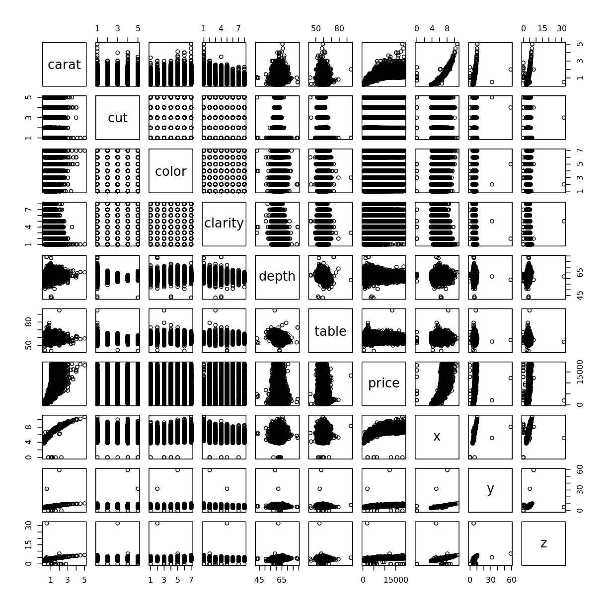

---
# Please do not edit this file directly; it is auto generated.
# Instead, please edit 03-Data.md in _episodes_rmd/
title: Data
teaching: 30
exercises: 15
questions: 
- "What are the basic data types in R?"
- "How do I represent categorical information in R?"
objectives:
- "To be aware of the different types of data."
- "To be able to ask questions from R about the type, class, and structure of an object."
keypoints:
- "The basic data types in R are double, integer, complex, logical, and character."
- "Use factors to represent categories in R."
source: Rmd
---

## Data Types
* Character / String
* Integer / Numeric
* Boolean / Logical
* Date

## Data Types

An important concept in programming called *data types*. There are 5 
main types: `double`, `integer`, `complex`, `logical` and `character`.

~~~
typeof(3.14)
~~~
{: .language-r}

~~~
[1] "double"
~~~
{: .output}

~~~
typeof(1L) # The L suffix forces the number to be an integer, since by default R uses float numbers
~~~
{: .language-r}

~~~
[1] "integer"
~~~
{: .output}

~~~
typeof(1+1i)
~~~
{: .language-r}

~~~
[1] "complex"
~~~
{: .output}

~~~
typeof(TRUE)
~~~
{: .language-r}

~~~
[1] "logical"
~~~
{: .output}

~~~
typeof('banana')
~~~
{: .language-r}

~~~
[1] "character"
~~~
{: .output}

No matter how complicated our analyses become, all data in R is 
interpreted as one of these basic data types. This strictness has some 
really important consequences.

When reading in data, the package readr uses a heuristic to figure out the 
type of each column. This can be emulated using guess_parser(), which returns
readr's best guess:

~~~
guess_parser("2019-12-01")
~~~
{: .language-r}

~~~
[1] "date"
~~~
{: .output}

~~~
guess_parser("15:01")
~~~
{: .language-r}

~~~
[1] "time"
~~~
{: .output}

~~~
guess_parser(c("TRUE", "FALSE"))
~~~
{: .language-r}

~~~
[1] "logical"
~~~
{: .output}

~~~
guess_parser(c("1", "33", "21"))
~~~
{: .language-r}

~~~
[1] "double"
~~~
{: .output}

~~~
guess_parser(c("12,341,234"))
~~~
{: .language-r}

~~~
[1] "number"
~~~
{: .output}

The heuristic tries each of the following types, stopping when it finds a
match:
<li>logical: contains only "T", "F", "TRUE" or "FALSE"</li>
<li>integer: contains only numeric, positive and negative</li>
<li>double: contains only valid doubles, including scientific notations</li>
<li>number: contains valid doubles with the grouping mark inside</li>
<li>time: matches the default time_format</li>
<li>date: matches the default date_format</li>
<li>date-time: any ISO8602 date </li>

If none of these rules apply, then the column will stay as a vector of strings.

There are many ways to view the data and look at its data types, and the
structure of the data.  To look at the first 5 rows of the diamonds dataset:

~~~
head(diamonds, 5)
~~~
{: .language-r}

~~~
# A tibble: 5 x 10
  carat cut     color clarity depth table price     x     y     z
  <dbl> <ord>   <ord> <ord>   <dbl> <dbl> <int> <dbl> <dbl> <dbl>
1 0.23  Ideal   E     SI2      61.5    55   326  3.95  3.98  2.43
2 0.21  Premium E     SI1      59.8    61   326  3.89  3.84  2.31
3 0.23  Good    E     VS1      56.9    65   327  4.05  4.07  2.31
4 0.290 Premium I     VS2      62.4    58   334  4.2   4.23  2.63
5 0.31  Good    J     SI2      63.3    58   335  4.34  4.35  2.75
~~~
{: .output}

and the last 10 rows:

~~~
tail(diamonds, 10)
~~~
{: .language-r}

~~~
# A tibble: 10 x 10
   carat cut       color clarity depth table price     x     y     z
   <dbl> <ord>     <ord> <ord>   <dbl> <dbl> <int> <dbl> <dbl> <dbl>
 1  0.71 Premium   E     SI1      60.5    55  2756  5.79  5.74  3.49
 2  0.71 Premium   F     SI1      59.8    62  2756  5.74  5.73  3.43
 3  0.7  Very Good E     VS2      60.5    59  2757  5.71  5.76  3.47
 4  0.7  Very Good E     VS2      61.2    59  2757  5.69  5.72  3.49
 5  0.72 Premium   D     SI1      62.7    59  2757  5.69  5.73  3.58
 6  0.72 Ideal     D     SI1      60.8    57  2757  5.75  5.76  3.5 
 7  0.72 Good      D     SI1      63.1    55  2757  5.69  5.75  3.61
 8  0.7  Very Good D     SI1      62.8    60  2757  5.66  5.68  3.56
 9  0.86 Premium   H     SI2      61      58  2757  6.15  6.12  3.74
10  0.75 Ideal     D     SI2      62.2    55  2757  5.83  5.87  3.64
~~~
{: .output}

To look at the structure of the data:

~~~
glimpse(diamonds)
~~~
{: .language-r}

~~~
Observations: 53,940
Variables: 10
$ carat   <dbl> 0.23, 0.21, 0.23, 0.29, 0.31, 0.24, 0.24, 0.26, 0.22, 0.…
$ cut     <ord> Ideal, Premium, Good, Premium, Good, Very Good, Very Goo…
$ color   <ord> E, E, E, I, J, J, I, H, E, H, J, J, F, J, E, E, I, J, J,…
$ clarity <ord> SI2, SI1, VS1, VS2, SI2, VVS2, VVS1, SI1, VS2, VS1, SI1,…
$ depth   <dbl> 61.5, 59.8, 56.9, 62.4, 63.3, 62.8, 62.3, 61.9, 65.1, 59…
$ table   <dbl> 55, 61, 65, 58, 58, 57, 57, 55, 61, 61, 55, 56, 61, 54, …
$ price   <int> 326, 326, 327, 334, 335, 336, 336, 337, 337, 338, 339, 3…
$ x       <dbl> 3.95, 3.89, 4.05, 4.20, 4.34, 3.94, 3.95, 4.07, 3.87, 4.…
$ y       <dbl> 3.98, 3.84, 4.07, 4.23, 4.35, 3.96, 3.98, 4.11, 3.78, 4.…
$ z       <dbl> 2.43, 2.31, 2.31, 2.63, 2.75, 2.48, 2.47, 2.53, 2.49, 2.…
~~~
{: .output}

~~~
pairs(diamonds)
~~~
{: .language-r}

~~~
class(diamonds)
~~~
{: .language-r}

~~~
[1] "tbl_df"     "tbl"        "data.frame"
~~~
{: .output}

## Factors

Another important data structure is called a *factor*. Factors usually look like
character data, but are typically used to represent categorical information. For
example, let's make a vector of strings labelling cat colorations for all the
cats in our study:

~~~
coats <- c('tabby', 'tortoiseshell', 'tortoiseshell', 'black', 'tabby')
coats
~~~
{: .language-r}

~~~
[1] "tabby"         "tortoiseshell" "tortoiseshell" "black"        
[5] "tabby"        
~~~
{: .output}

~~~
str(coats)
~~~
{: .language-r}

~~~
 chr [1:5] "tabby" "tortoiseshell" "tortoiseshell" "black" "tabby"
~~~
{: .output}

We can turn a vector into a factor like so:

~~~
CATegories <- factor(coats)
class(CATegories)
~~~
{: .language-r}

~~~
[1] "factor"
~~~
{: .output}

~~~
glimpse(CATegories)
~~~
{: .language-r}

~~~
 Factor w/ 3 levels "black","tabby",..: 2 3 3 1 2
~~~
{: .output}

Now R has noticed that there are three possible categories in our data - but it
also did something surprising; instead of printing out the strings we gave it,
we got a bunch of numbers instead. R has replaced our human-readable categories
with numbered indices under the hood, this is necessary as many statistical
calculations utilise such numerical representations for categorical data:

~~~
typeof(coats)
~~~
{: .language-r}

~~~
[1] "character"
~~~
{: .output}

~~~
typeof(CATegories)
~~~
{: .language-r}

~~~
[1] "integer"
~~~
{: .output}

In modelling functions, it's important to know what the baseline levels are. This
is assumed to be the first factor, but by default factors are labelled in
alphabetical order. You can change this by specifying the levels:

~~~
mydata <- c("case", "control", "control", "case")
factor_ordering_example <- factor(mydata, levels = c("control", "case"))
glimpse(factor_ordering_example)
~~~
{: .language-r}

~~~
 Factor w/ 2 levels "control","case": 2 1 1 2
~~~
{: .output}

In this case, we've explicitly told R that "control" should represented by 1, and
"case" by 2. This designation can be very important for interpreting the
results of statistical models!

## Dates

The lubridate package reading and working with dates and times easier. To get the current date or date-time:

~~~
today()
~~~
{: .language-r}

~~~
[1] "2019-03-06"
~~~
{: .output}

~~~
now()
~~~
{: .language-r}

~~~
[1] "2019-03-06 14:33:30 AEDT"
~~~
{: .output}

When working dates, you can specify the format when reading a string:

~~~
ymd("2019-02-13")
~~~
{: .language-r}

~~~
[1] "2019-02-13"
~~~
{: .output}

~~~
mdy("February 2nd, 2019")
~~~
{: .language-r}

~~~
[1] "2019-02-02"
~~~
{: .output}

~~~
dmy("13-Feb-2019")
~~~
{: .language-r}

~~~
[1] "2019-02-13"
~~~
{: .output}

Date-time can be created:

~~~
ymd_hms("2019-02-13 20:11:23")
~~~
{: .language-r}

~~~
[1] "2019-02-13 20:11:23 UTC"
~~~
{: .output}

~~~
mdy_hm("2019-02-13 08:02")
~~~
{: .language-r}

~~~
Warning: All formats failed to parse. No formats found.
~~~
{: .error}

~~~
[1] NA
~~~
{: .output}
