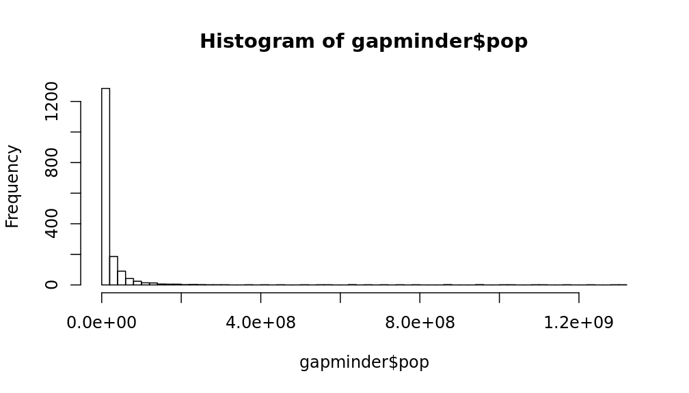

---
# Please do not edit this file directly; it is auto generated.
# Instead, please edit 13-Data-Verbs---summarise.md in _episodes_rmd/
title: Summarise and Grouping
teaching: 
exercises: 
questions:
objectives:
keypoints:
source: Rmd
---

The `summarise()` function lets us create new variables by collapsing a data frame into a single 
summary statistic. You can use `summarise()` with any function that takes a vector as input and 
returns a single value as output. For example, what is the average life expectance in the gapminder 
data?

~~~
gapminder %>% 
  summarise(mean_life_exp = mean(lifeExp))
~~~
{: .language-r}

~~~
# A tibble: 1 x 1
  mean_life_exp
          <dbl>
1          59.5
~~~
{: .output}

On it's own, this may not seem that exciting. You could just as easily get the same result by using
`mean(gapminder$lifeExp)`. Where is becomes more useful however, is that you can use multiple 
summary functions at the same time

~~~
gapminder %>% 
  summarise(
    mean_life_exp = mean(lifeExp),
    sd_life_exp = sd(lifeExp),
    mean_gdp_per_cap = mean(gdpPercap),
    max_gdp_per_cap = max(gdpPercap)
    )
~~~
{: .language-r}

~~~
# A tibble: 1 x 4
  mean_life_exp sd_life_exp mean_gdp_per_cap max_gdp_per_cap
          <dbl>       <dbl>            <dbl>           <dbl>
1          59.5        12.9            7215.         113523.
~~~
{: .output}

and you can get summaries for different groups in conjunction with `group_by()`

~~~
gapminder %>% 
  group_by(country) %>% 
  summarise(mean_life_exp = mean(lifeExp))
~~~
{: .language-r}

~~~
# A tibble: 142 x 2
   country     mean_life_exp
   <chr>               <dbl>
 1 Afghanistan          37.5
 2 Albania              68.4
 3 Algeria              59.0
 4 Angola               37.9
 5 Argentina            69.1
 6 Australia            74.7
 7 Austria              73.1
 8 Bahrain              65.6
 9 Bangladesh           49.8
10 Belgium              73.6
# … with 132 more rows
~~~
{: .output}
> ## Challenge 1
> Calculate the mean and median population for each continent. What does comparing these two numbers
> suggest about the data?
> > ## Solution to Challenge 1
> > 
> > ~~~
> > gapminder %>% 
> >   group_by(continent) %>% 
> >   summarise(mean_pop = mean(pop), median_pop = median(pop))
> > ~~~
> > {: .language-r}
> > 
> > 
> > 
> > ~~~
> > # A tibble: 5 x 3
> >   continent  mean_pop median_pop
> >   <chr>         <dbl>      <dbl>
> > 1 Africa     9916003.   4579311 
> > 2 Americas  24504795.   6227510 
> > 3 Asia      77038722.  14530830.
> > 4 Europe    17169765.   8551125 
> > 5 Oceania    8874672.   6403492.
> > ~~~
> > {: .output}
> > There is a big difference between the mean and median value for each continent. This suggests 
> > that the population data is highly skewed.
> {: .solution}
{: .challenge}

> ## Challenge 2
> The reason for your result in Challenge 1 is easy to see if you look at the population data.
> 
> Try transforming the population data using `mutate()` before repeating your summary. What is the 
> difference?
> > ## Solution to Challenge 2
> > 
> > ~~~
> > gapminder %>% 
> >   mutate(log_pop = log10(pop)) %>% 
> >   group_by(continent) %>% 
> >   summarise(
> >     mean_log_pop = mean(log_pop), 
> >     median_log_pop = median(log_pop)
> >   )
> > ~~~
> > {: .language-r}
> > 
> > 
> > 
> > ~~~
> > # A tibble: 5 x 3
> >   continent mean_log_pop median_log_pop
> >   <chr>            <dbl>          <dbl>
> > 1 Africa            6.59           6.66
> > 2 Americas          6.90           6.79
> > 3 Asia              7.14           7.16
> > 4 Europe            6.93           6.93
> > 5 Oceania           6.82           6.78
> > ~~~
> > {: .output}
> {: .solution}
{: .challenge}

## Sorting your results
If you are wanting to sort your resulting data frame by a particular variable, use `arrange()`

~~~
gapminder %>% 
  arrange(gdpPercap)
~~~
{: .language-r}

~~~
# A tibble: 1,704 x 6
   country          continent  year lifeExp      pop gdpPercap
   <chr>            <chr>     <dbl>   <dbl>    <dbl>     <dbl>
 1 Congo, Dem. Rep. Africa     2002    45.0 55379852      241.
 2 Congo, Dem. Rep. Africa     2007    46.5 64606759      278.
 3 Lesotho          Africa     1952    42.1   748747      299.
 4 Guinea-Bissau    Africa     1952    32.5   580653      300.
 5 Congo, Dem. Rep. Africa     1997    42.6 47798986      312.
 6 Eritrea          Africa     1952    35.9  1438760      329.
 7 Myanmar          Asia       1952    36.3 20092996      331 
 8 Lesotho          Africa     1957    45.0   813338      336.
 9 Burundi          Africa     1952    39.0  2445618      339.
10 Eritrea          Africa     1957    38.0  1542611      344.
# … with 1,694 more rows
~~~
{: .output}

~~~
# Use desc() to sort from highest to lowest
gapminder %>% 
  arrange(desc(gdpPercap))
~~~
{: .language-r}

~~~
# A tibble: 1,704 x 6
   country   continent  year lifeExp     pop gdpPercap
   <chr>     <chr>     <dbl>   <dbl>   <dbl>     <dbl>
 1 Kuwait    Asia       1957    58.0  212846   113523.
 2 Kuwait    Asia       1972    67.7  841934   109348.
 3 Kuwait    Asia       1952    55.6  160000   108382.
 4 Kuwait    Asia       1962    60.5  358266    95458.
 5 Kuwait    Asia       1967    64.6  575003    80895.
 6 Kuwait    Asia       1977    69.3 1140357    59265.
 7 Norway    Europe     2007    80.2 4627926    49357.
 8 Kuwait    Asia       2007    77.6 2505559    47307.
 9 Singapore Asia       2007    80.0 4553009    47143.
10 Norway    Europe     2002    79.0 4535591    44684.
# … with 1,694 more rows
~~~
{: .output}

> ## Challenge 3
> Calculate the average life expectancy per country. Which has the shortest average life expectancy 
> and which has the longest average life expectancy?
> > ## Solution to Challenge 3
> > 
> > ~~~
> > summarised_life_exp <- gapminder %>%
> >   group_by(country) %>%
> >   summarise(mean_life_exp = mean(lifeExp))
> > 
> > summarised_life_exp %>% 
> >   arrange(mean_life_exp)
> > ~~~
> > {: .language-r}
> > 
> > 
> > 
> > ~~~
> > # A tibble: 142 x 2
> >    country           mean_life_exp
> >    <chr>                     <dbl>
> >  1 Sierra Leone               36.8
> >  2 Afghanistan                37.5
> >  3 Angola                     37.9
> >  4 Guinea-Bissau              39.2
> >  5 Mozambique                 40.4
> >  6 Somalia                    41.0
> >  7 Rwanda                     41.5
> >  8 Liberia                    42.5
> >  9 Equatorial Guinea          43.0
> > 10 Guinea                     43.2
> > # … with 132 more rows
> > ~~~
> > {: .output}
> > 
> > 
> > 
> > ~~~
> > summarised_life_exp %>% 
> >   arrange(desc(mean_life_exp))
> > ~~~
> > {: .language-r}
> > 
> > 
> > 
> > ~~~
> > # A tibble: 142 x 2
> >    country     mean_life_exp
> >    <chr>               <dbl>
> >  1 Iceland              76.5
> >  2 Sweden               76.2
> >  3 Norway               75.8
> >  4 Netherlands          75.6
> >  5 Switzerland          75.6
> >  6 Canada               74.9
> >  7 Japan                74.8
> >  8 Australia            74.7
> >  9 Denmark              74.4
> > 10 France               74.3
> > # … with 132 more rows
> > ~~~
> > {: .output}
> {: .solution}
{: .challenge}

If you provide multiple variables to sort by, `arrange()` will initially sort by the first variable,
with any ties broken by the next variable and so on.

> ## Challenge 4
> Calculate the `mean_gdp_per_cap` per continent for each year. Remember that `group_by()` can 
> be given multiple grouping variables.
>
> Try piping your answer into each of the following two lines. What are the differences and 
> when might you use one over the other?
> ~~~~
> arrange(desc(year), desc(mean_gdp_per_cap))
> ~~~~
> {: .language-r}
> ~~~~
> arrange(desc(mean_gdp_per_cap), desc(year))
> ~~~~
> {: .language-r}
> > ## Solution to Challenge 4
> > 
> > ~~~
> > summarised_gdp <- gapminder %>%
> >   group_by(continent, year) %>%
> >   summarise(mean_gdp_per_cap = mean(gdpPercap))
> > 
> > summarised_gdp %>% 
> >   arrange(desc(year), desc(mean_gdp_per_cap))
> > ~~~
> > {: .language-r}
> > 
> > 
> > 
> > ~~~
> > # A tibble: 60 x 3
> > # Groups:   continent [5]
> >    continent  year mean_gdp_per_cap
> >    <chr>     <dbl>            <dbl>
> >  1 Oceania    2007           29810.
> >  2 Europe     2007           25054.
> >  3 Asia       2007           12473.
> >  4 Americas   2007           11003.
> >  5 Africa     2007            3089.
> >  6 Oceania    2002           26939.
> >  7 Europe     2002           21712.
> >  8 Asia       2002           10174.
> >  9 Americas   2002            9288.
> > 10 Africa     2002            2599.
> > # … with 50 more rows
> > ~~~
> > {: .output}
> > 
> > 
> > 
> > ~~~
> > summarised_life_exp %>% 
> >   arrange(desc(mean_gdp_per_cap), desc(year))
> > ~~~
> > {: .language-r}
> > 
> > 
> > 
> > ~~~
> > Error: object 'mean_gdp_per_cap' not found
> > ~~~
> > {: .error}
> {: .solution}
{: .challenge}
