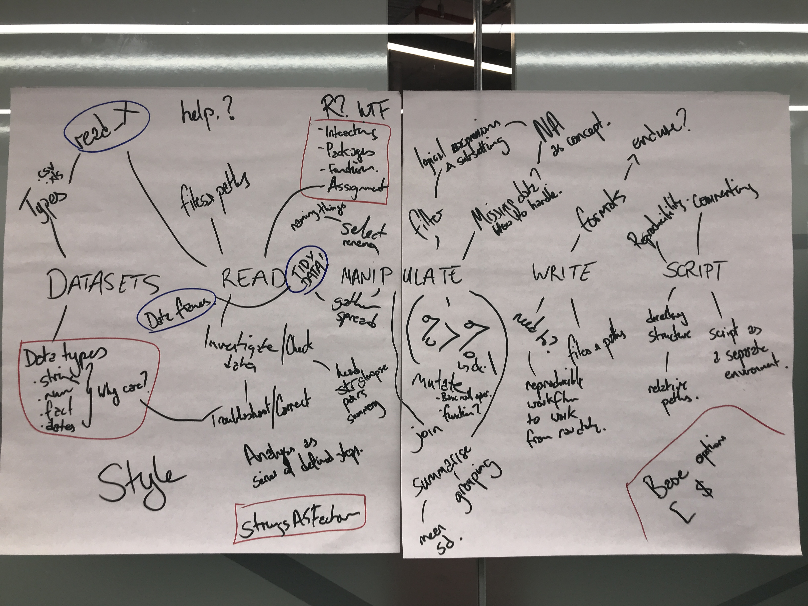

## Contributors

[Names]

We are actively seeking contributors to help with design of exercises, feeback on lessons, proofreading etc. Please submit a pull request to make your contribution.

## Process

We are loosely following the reverse instructional design process described in the software carpentry lesson template here: [reverse design] (http://carpentries.github.io/lesson-example/01-design/index.html) 

## Assumptions

**Audience:**
**Number of students:** 12
**Number of educators:** 2 + 1 helper
**Contact time:**
**Practical time:**
**Skill level:** Beginner through to lower intermediate. 
**Background:** CSIRO employees, including research scientists, technicians, and support staff. 
**Prior learning:**

## 1. Final task (Practical exercise)

### Task 

Take two (provided) unseen datasets, read them into R and answer specific questions about the features? of the data. Save the transformed data into a new file. Provide a script to perform these steps to a colleague and have them run it.

(Estimated time: 1 day learning - 30-45 minute task)

### Data

What kind of data do learners need to bring to the workshop, to complete this task? What features should the data have? (shape, size, complexity, licence etc).

Can you design this exercise on a predesigned data set if necessary? If so, what should this dataset look like, and where can we find it from? Do we need different data for different learners?

## 2. Concept map

What are all the ideas, connections, and assumptions a learner must master to achieve the task(s) described above? Please take photos of your concept maps and upload to the figures directory, with a link below.

## 3. Episodes

Break your concept map up into smaller 'chunks'. Each new map should only contain 5-6 ideas. These form the individual teaching 'episodes' from which our larger topic unit is composed. 

Give each 'chunk' a title and link to the smaller concept map figure below. Estimate the teaching time. 

## 4. Ordering

We all know how interconnected every concept is, however teaching happens in linear time (let's debate this over dinner!). So, we now need to turn our concept networks into ordered lists. 

Start by ordering your 'chunks' or episodes. Then write each idea or concept within a chunk onto a sticky note, and order the sticky notes. Make a poster of your stick note episodes! Do you episodes fit into your teaching time? Bring it to lunch for feedback.

Once you are happy with your design, please transcribe it below. 

## 5. Exercises (formative assessments)

Each sticky note needs an exercise! Start putting your episodes into GitHub, and formulating an exercise to test / teach each concept. Keep in mind the 'data' you described back in step one. Try and keep the exercises relevant and engaging.

Keep a note of exercises / tasks that still need work here. Raise them as git issues for completion post workshop. 

## NOTES & FEEDBACK
